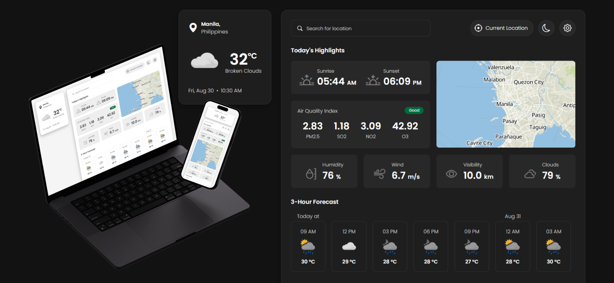

# 🌦️ Weather App

ReactJS Weather App project!

<div align='center'>
   <a href='https://weather-app-john-glay.vercel.app/' target="_blank">
      
   </a>
</div>

## Overview

This project is a simple weather application built with ReactJS. It fetches weather data from the OpenWeather API and displays it alongside a location map powered by MapTiler. The project serves as a hands-on learning experience, demonstrating how to integrate third-party APIs with React and build a complete, functional application from scratch.

## Features

- Fetch and display current weather data for any location
- User-friendly interface with styled-components
- Responsive design
- Error handling for API requests

## Getting Started

Follow these steps to set up and run the project on your local machine for development and testing.

### Prerequisites

- Node.js (v14 or higher)
- npm (v6 or higher) or yarn

### Installation

1. Clone the repository:

   ```sh
   git clone https://github.com/john-glay/Weather-App.git
   ```

2. Navigate to the project directory:

   ```sh
   cd Weather-App
   ```

3. Install dependencies:

   ```sh
   yarn install
   # or
   npm install
   ```
   
4. Create a  `.env`  file in the root directory and add your OpenWeather API key and MapTiler API key:

   ```sh
   REACT_APP_OPENWEATHER_API_KEY = "your_api_key_here"
   REACT_APP_MAPTILER_API_KEY = "your_api_key_here"
   ```

### Usage

1. Start the development server:

   ```sh
   yarn start
   # or
   npm start
   ```

2. Open your browser and go to [http://localhost:3000](http://localhost:3000) to see the app in action.

## Dependencies

This project uses the following dependencies:

- **axios**: A promise-based HTTP client used for making requests to the OpenWeather API and MapTiler API. It simplifies the process of handling HTTP requests and responses from these services.
- **bootstrap-icons**: A library of free, high-quality icons designed for Bootstrap, but usable in any project. These icons enhance the visual appeal and user experience of the app.
- **dotenv**: A module that loads environment variables from a `.env` file into `process.env`, allowing secure management of API keys and other sensitive information.
- **maplibre-gl**: A powerful library for rendering interactive maps, used in conjunction with MapTiler to display location data.
- **react-loading-skeleton**: A React component for easily creating skeleton screens while content is loading, improving the user experience.

## API Reference

This project uses the OpenWeather API to fetch weather data and MapTiler to display the location. You can find more information and sign up for an API key at their respective websites:

- **OpenWeather API**: https://openweathermap.org/api
- **MapTiler**: https://www.maptiler.com/cloud/

## License

This project is licensed under the MIT License. See the [LICENSE](LICENSE) file for more details.

---
[](https://git.io/typing-svg)
